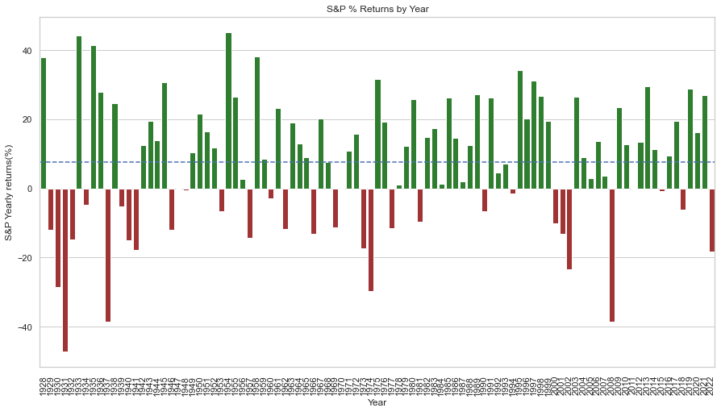
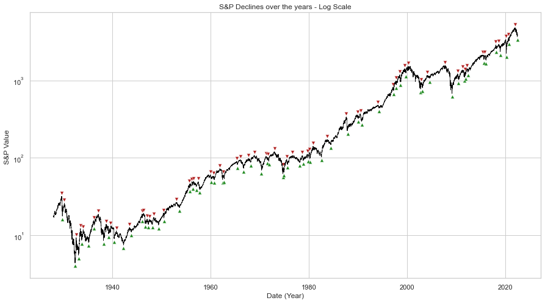
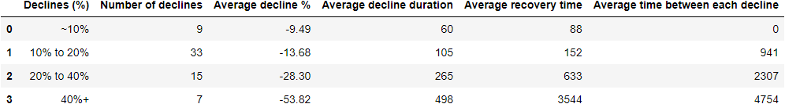

# S&P500 Declines

**Disclaimer:** I'm not an economist, nor certified investors or someone professionally qualified to put in question the data integrity or the effects of this report on the markets, the whole purpose of this project is to put in practice my data analysis studies.

Table of contents
========
- [S&P500 Declines](#sp500-declines)
- [Table of contents](#table-of-contents)
  - [### 1. Executive Summary](#-1-executive-summary)
  - [### 2. Exploratory analysis](#-2-exploratory-analysis)
      - [**2.1 Yearly returns**](#21-yearly-returns)
  - [#### **2.2 Mapping declines**](#-22-mapping-declines)
  - [### 3. Conclusion](#-3-conclusion)

### 1. Executive Summary
---
The motivation of this project came about when listening to a Peter Lynch lecture from 1997. On said lecture, Lynch said: "I know we've had 96 years this century and the market's fallen 53 times, 53 declines of 10% or more, so 53 declines in 96 years, once every 2 years we have a 10% declines, 15 times 25% or more, so once every six years we have a decline of 25% or more, that is what we call a bear market". During my research I've found that Lynch said this in other lectures with slightly date variations(Earliest one I found was from 1994). Since then, a litte more than 20 years have passed, so I decided to see not just if the trends are the same, but also get a little bit deeper on the analysis.

It is important to note that the data analyzed on this project starts in 1927, but the S&P index as we know it today, S&P500, only exists since 1957. The data was collected from Yahoo Finance S&P 500(^GSPC).

### 2. Exploratory analysis
---

#### **2.1 Yearly returns**

The statements made by Peter Lynch were made in the context that, some do not invest in fears of declines, but that is part of the game and declines can't be predicted or avoided. Just by looking at the yearly returns on the S&P, it is possible to see that the majority of years are positive with some years negative years in between, the average return was calculated to be 7.69% on the year. Which shows how sporadic declines are, but overall market returns tend to be positive.

  

#### **2.2 Mapping declines**
---

In this study, a total of 63 declines were mapped as showed on the following chart. Although the initial idea was to track only the declines equal or larger than 10%, some declines that got close enough to the 10% mark were also included (The decision between what is close enough and the importance of these declines was purely arbitrary).

*Note: The complete table with the declines can be found in the images folder* 

  

After mapping the declines, the following table was created in order to better understand the data and get some statistics. 

Although in financial markets, some definitions are quite loose, it was decided to group the data in near minor declines(near 10%), minor declines (10%~20%), bear markets(20%~40%) and recessions(40%+). The average time between each decline in the ~10% was purposely not calculated in order to not imply false assumptions.

It was interesting to see that, on average declines between 10% and 20% happen every 941 days (~2 and half years) and declines between 20% and 40% happens every 2307 days (Around 6 years). Numbers that are quite close to Lynch's speech.

  

### 3. Conclusion
---
There are many important things to be aware looking at this study. The first one being the fact that the data used was collected from a free source without extensive research. Secondly, but no less important is the fact that even tho these statistics about Average decline durations and recovery times can be seen as metrics to try to predict future declines, this is not advisable. In finance, it was already proved many times that trees don't grow to the sky and not many things go to zero, so trying to predict the future is futile. Each of these declines had different environments and fundamentals that created the results seen on data.

The main takeaway from this analysis is that on average, the greater the declines are the longer they take to recover and the longer they take to happen again, but are in fact unavoidable and really promote the importance of the virtue of patience in investing. 